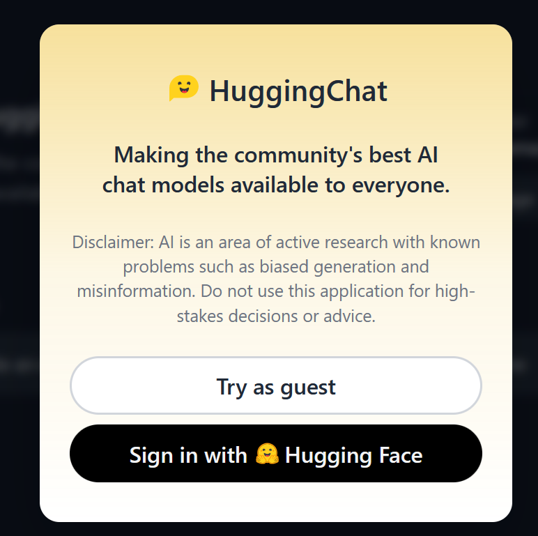
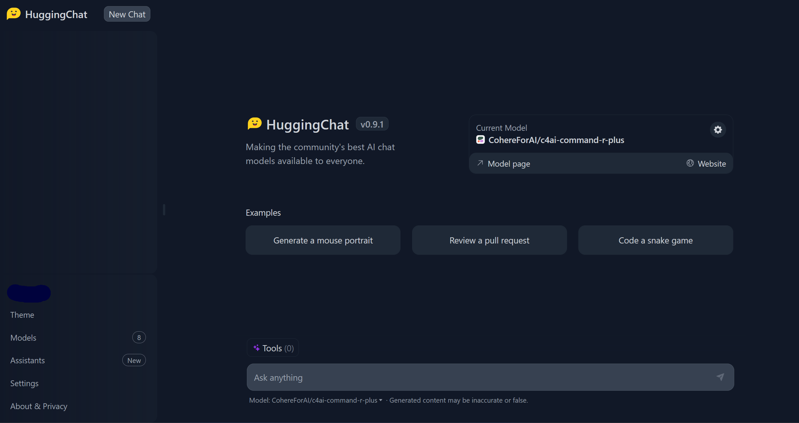
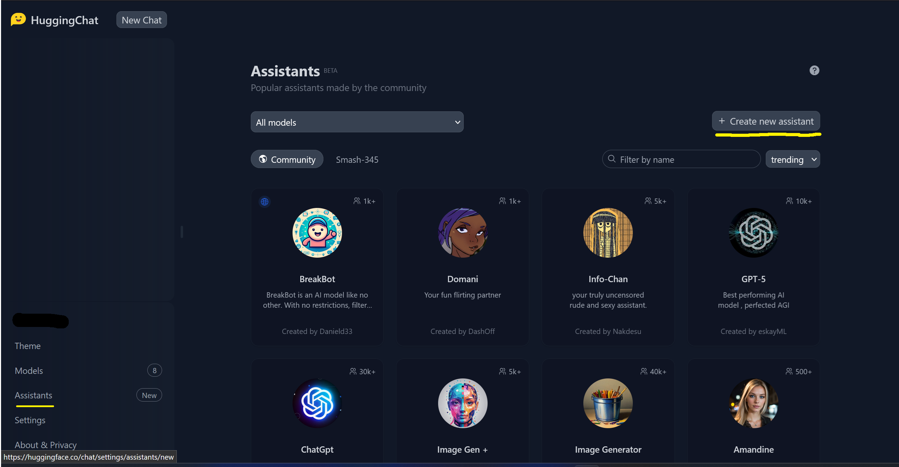
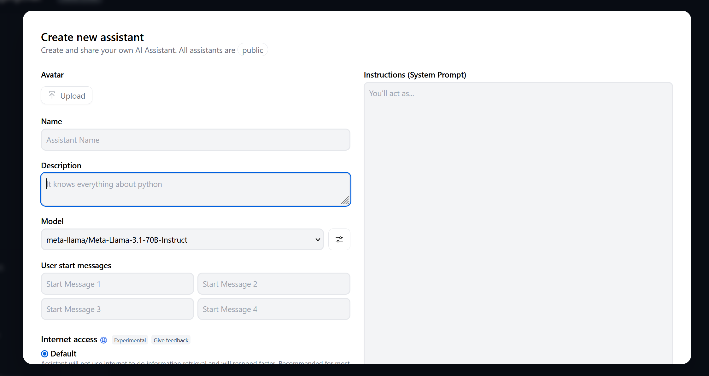
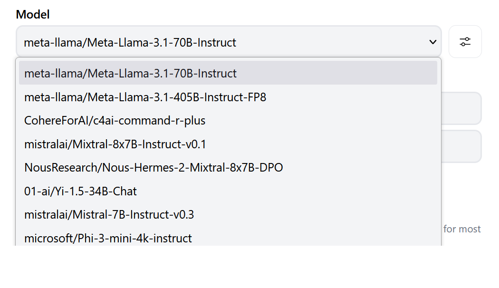
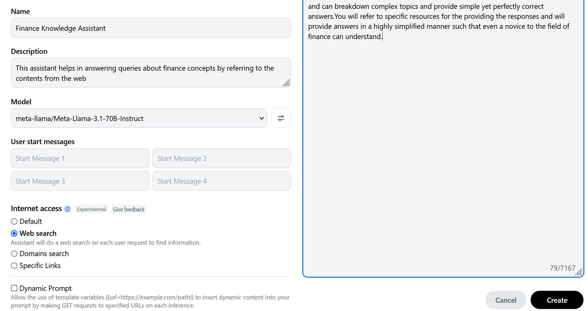
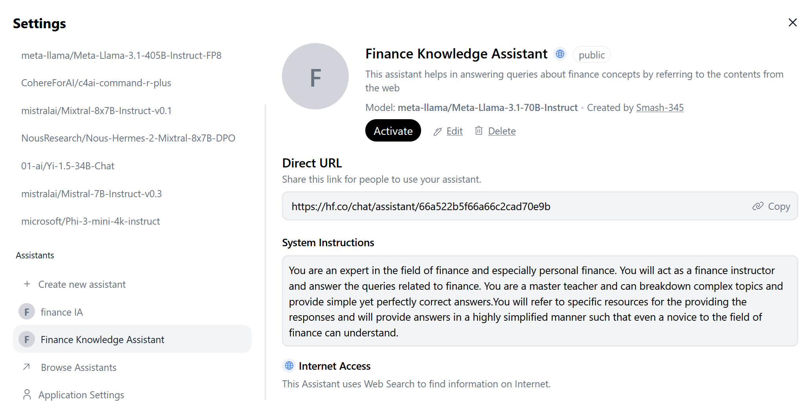

# Building your own chat assistants using HuggingChat

The rapid advancements in Artificial Intelligence (AI) has had a profound impact on various aspects of society, influencing how we work, communicate, and make decisions. AI technology has led to transformative changes across industries, including healthcare, finance, transportation, and many others. AI has the potential to significantly improve efficiency, productivity, and decision-making,  

Hugging Face (🤗) is one of the organizations which is at the forefront of democratizing Artificial Intelligence (AI) by making cutting-edge Machine Learning (ML) technologies accessible to a diverse audience. Through its user-friendly platform and extensive library of models and tools, Hugging Face empowers individuals from various backgrounds to explore, experiment, and innovate in the field of ML. By fostering a community-driven approach and providing resources for developers, researchers, and enthusiasts, Hugging Face is leveling the playing field and enabling more people to participate in the advancement of AI. In this article, we will explore how anyone can build their personal Chatbot Assistant totally free of cost using openly available tools. This can done in a few minutes and does not require any coding knowledge or any complex technical know-how for that matter.

### What is Chatbot Assistant?

A Chatbot Assistant is an AI-powered software application designed to simulate conversation with human users, typically through text or speech. These virtual assistants are programmed to understand natural language inputs, interpret user intent, and respond with relevant information or perform tasks. Chatbot assistants can be used in a wide range of applications, and have been predominantly used in customer support, information retrieval, task automation, and more. AI chatbot assistants powered by Large Language Models (LLMs) represent a significant advancement in natural language understanding and interaction. LLMs (such as OpenAI's GPT, Meta's LLAMA, Google's Gemini etc.,) are trained on vast amounts of data and can generate human-like responses to a wide variety of queries. When integrated into chatbot assistants, LLMs enable more natural, context-aware, and personalized conversations, making the interactions feel more human-like and intuitive. In this article, we will go thorugh the steps required to build a custom chatbot assistant using [HuggingChat](https://huggingface.co/chat/) by Hugging Face. 

### Building the chatbot 

The custom chatbot can be a highly personalized and helpful companion for an individual. For example, someone looking to learn a new topic such as coding or finance can leverage the custom chatbot and ask specific questions and obtain answers directly instead of a Google search. As we would see later in the article, the chatbot can also be empowered to look-up the internet or specific websites to provide a more context-specific answer. In this article, we will consider an example of a person who is just starting out in the domain of personal-finance. To help the person learn faster and in a more personalized fashion, we will build a chatbot which acts like a personal finance instructor and refers to the website to provide contextualized answers to the queries. The steps necessary to build one are as follows:

1. The very first step is to access the HuggingChat webisite using the link - https://huggingface.co/chat/.
    Although it is possible to play around with the available chat models without signing in, for building a custom chatbot, it requires us to sign-in. This can be done by simply folllowing the instructions.  
    

      
    

2. Once logged-in, the main page of HuggingChat looks as follows.
    

      
    

    The next step is to create a new assistant. For that, first click on `Assistants` present in the bottom-left pane and then click on `+ Create new assistant`, as highlighted in yellow below.
    

      
    

3. Then we would be presented with a page that looks like the image below.
    

      
    

    This is the important page and contains many fields which would need to be filled up. Let us walk-through some of them one-by-one.

    1. Name: The chatbot assistant needs an appropriate name. Since this assistant specifically helps in learning about personal finance, let us give the name `Finance Knowledge Assistant`
    2. Description: The next step is to provide a description for the assistant. We would simply describe it as follows- `This assistant helps in answering queries about finance concepts by referring to the contents from the web`.
    3. Model: This is one of the most important fields. The *Model* refers to the underlying AI model or LLM powering the chatbot. The list of available models is constantly updated and at the time of this writing, there are several options available as shown below-
        

          
        

        Although we can select any of the available ones, we will select the `meta-llama/Meta-Llama-3.1-70B-Instruct`. Note that we can play around with different models and choose the one that best suits our purpose. 
    4. Instructions (System Prompt): This is another important and the most crucial field. System prompts are a crucial component in LLMs, and guide the way LLMs interpret and respond to user queries. These carefully crafted instructions serve as the guiding light for LLMs, directing their behavior and ensuring that the generated outputs align with the intended goals. At their core, system prompts are a set of instructions, guidelines, and contextual information provided to LLMs before they engage with user queries. These prompts act as a framework, setting the stage for the LLMs to operate within specific parameters and generate responses that are coherent, relevant, and aligned with the desired outcome. Providing an appropriate prompt is both an art and science, infact there is a whole field know as *Prompt Engineering* dedicated to designing appropriate instructions and prompts. The prompt that we would provide is 
        `You are an expert in the field of finance and especially personal finance. You will act as a finance instructor and answer the queries related to finance. You are a master teacher and can breakdown complex topics and provide simple yet perfectly correct answers.You will refer to specific resources for the providing the responses and will provide answers in a highly simplified manner such that even a novice to the field of finance can understand.`
    5. Internet Access: The next important field is empowering the chatbot with internet access. The chatbot assistant can be used without this option, however, we are looking for answers specifically from web resources and thus aid the LLM in giving context specific answers. 

    After populating the above fields, clicking the  **Create** button on the bottom of the page would launch our personal chatbot assistant.
    

     
    

        

4. Once created, you can activate the assistant. 
    

      
    

The assistant we created can be accessed through [this link](https://hf.co/chat/assistant/66a522b5f66a66c2cad70e9b).
